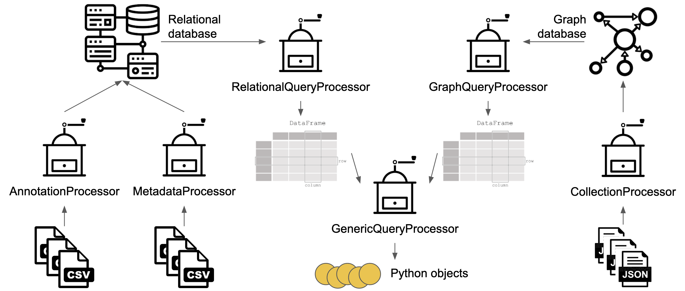
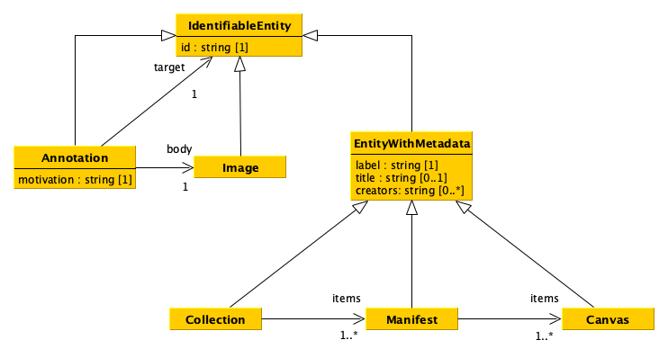
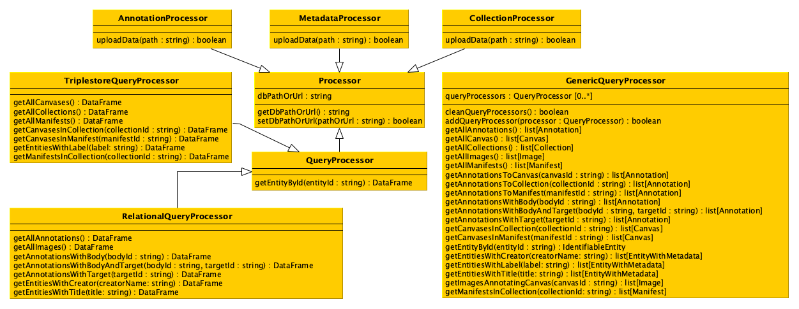

# Data Science: project

The goal of the project is to develop a software that enables one to process data stored in different formats and to upload them into two distinct databases to query these databases simultaneously according to predefined operations. 

## Data

Exemplar data for testing the project have been made available. In particular:

* for creating the relational database, there are two files, two CSV files with [annotations](data/annotations.csv) and [metadata](data/metadata.csv), containing annotations describing images and including metadata of IIIF objects, i.e. collections, manifests and canvases (please note that multiple creators of the same object will be contained in just one string and split by `; `);

* for creating the RDF triplestore, there are two files, [a JSON file](data/collection-1.json) containing the IIIF collection "Works of Dante Alighieri" and [another JSON file](data/collection-2.json) containing the IIIF collection "Fondo Giuseppe Raimondi". Each collection contains information of the other IIIF entities (i.e. manifests and canvases): their identifiers, types, labels, and containement relations.

## Workflow



## Data model



## UML of data model classes


All the methods of each class must return the appropriate value that have been specified in the object of that class when it has been created. It is up to the implementer to decide how to enable someone to add this information to the object of each class, e.g. by defining a specific constructor. While one can add additional methods to each class if needed, it is crucial that the *get* methods introduced in the UML diagram are all defined.

## UML of additional classes



All the attributes methods of each class are defined as follows. All the constructors of each of the class introduced in the UML diagram do not take in input any parameter. While one can add additional methods to each class if needed, it is crucial that all the methods introduced in the UML diagram are defined.


### Class `Processor`

#### Attributes
`dbPathOrUrl`: the variable containing the path or the URL of the database, initially set as an empty string, that will be updated with the method `setDbPathOrUrl`.

#### Methods
`getDbPathOrUrl`: it returns the path or URL of the database.

`setDbPathOrUrl`: it enables to set a new path or URL for the database to handle.


### Class `AnnotationProcessor`

#### Methods
`uploadData`: it takes in input the path of a CSV file containing annotations and uploads them in the database. This method can be called everytime there is a need to upload annotations in the database.


### Class `MetadataProcessor`

#### Methods
`uploadData`: it takes in input the path of a CSV file containing metadata and uploads them in the database. This method can be called everytime there is a need to upload annotations in the database.


### Class `CollectionProcessor`

#### Methods
`uploadData`: it takes in input the path of a JSON file containing collections (with manifests and canvases) and uploads them in the database. This method can be called everytime there is a need to upload collections in the database.


### Class `QueryProcessor`

#### Methods
`getEntityById`: it returns a data frame with all the entities matching the input identifier (i.e. maximum one entity).


### Class `RelationalQueryProcessor`

#### Methods
`getAllAnnotations`: it returns a data frame containing all the annotations included in the database.

`getAllImages`: it returns a data frame containing all the images included in the database.

`getAnnotationsWithBody`: it returns a data frame containing all the annotations included in the database that have, as annotation body, the entity specified by the input identifier.

`getAnnotationsWithBodyAndTarget`: it returns a data frame containing all the annotations included in the database that have, as annotation body and annotation target, the entities specified by the input identifiers.

`getAnnotationsWithTarget`: it returns a data frame containing all the annotations included in the database that have, as annotation target, the entity specified by the input identifier.

`getEntitiesWithCreator`: it returns a data frame containing all the metadata included in the database related to the entities having the input creator as one of their creators.

`getEntitiesWithLabel`: it returns a data frame containing all the metadata included in the database related to the entities having, as label, the input label.

`getEntitiesWithTitle`: it returns a data frame containing all the metadata included in the database related to the entities having, as title, the input title.


### Class `TriplestoreQueryProcessor`

#### Methods
`getAllCanvases`: it returns a data frame containing all the canvases included in the database.

`getAllCollections`: it returns a data frame containing all the collections included in the database.

`getAllManifests`: it returns a data frame containing all the manifests included in the database.

`getCanvasesInCollection`: it returns a data frame containing all the canvases included in the database that are contained in the collection identified by the input identifier.

`getCanvasesInManifest`: it returns a data frame containing all the canvases included in the database that are contained in the manifest identified by the input identifier.

`getManifestsInCollection`: it returns a data frame containing all the manifests included in the database that are contained in the collection identified by the input identifier.


### Class `GenericQueryProcessor`

#### Attributes
`queryProcessors`: the variable containing the list of `QueryProcessor` objects to involve when one of the *get* methods below is executed. In practice, every time a *get* method is executed, the method will call the related method on all the `QueryProcessor` objects included in the variable `queryProcessors`, before combining the results and returning the requested object.

#### Methods
`cleanQueryProcessors`: It clean the list `queryProcessors` from all the `QueryProcessor` objects it includes.

`addQueryProcessor`: It append the input `QueryProcessor` object to the list `queryProcessors`.

`getAllAnnotations`: it returns a list of objects having class `Annotation` included in the databases accessible via the query processors.

`getAllCanvas`: it returns a list of objects having class `Canvas` included in the databases accessible via the query processors.

`getAllCollections`: it returns a list of objects having class `Collection` included in the databases accessible via the query processors.

`getAllImages`: it returns a list of objects having class `Image` included in the databases accessible via the query processors.

`getAllManifests`: it returns a list of objects having class `Manifest` included in the databases accessible via the query processors.

`getAnnotationsToCanvas`: it returns a list of objects having class `Annotation`, included in the databases accessible via the query processors, that have, as annotation target, the canvas specified by the input identifier.

`getAnnotationsToCollection`: it returns a list of objects having class `Annotation`, included in the databases accessible via the query processors, that have, as annotation target, the collection specified by the input identifier.

`getAnnotationsToManifest`: it returns a list of objects having class `Annotation`, included in the databases accessible via the query processors, that have, as annotation target, the manifest specified by the input identifier.

`getAnnotationsWithBody`: it returns a list of objects having class `Annotation`, included in the databases accessible via the query processors, that have, as annotation body, the entity specified by the input identifier.

`getAnnotationsWithBodyAndTarget`: it returns a list of objects having class `Annotation`, included in the databases accessible via the query processors, that have, as annotation body and annotation target, the entities specified by the input identifiers.

`getAnnotationsWithTarget`: it returns a list of objects having class `Annotation`, included in the databases accessible via the query processors, that have, as annotation target, the entity specified by the input identifier.

`getCanvasesInCollection`: it returns a list of objects having class `Canvas`, included in the databases accessible via the query processors, that are contained in the collection identified by the input identifier.

`getCanvasesInManifest`: it returns a list of objects having class `Canvas`, included in the databases accessible via the query processors, that are contained in the manifest identified by the input identifier.

`getEntityById`: it returns a object having class `Entity` identify the entity available in the databases accessible via the query processors matching the input identifier (i.e. maximum one entity).

`getEntitiesWithCreator`: it returns a list of objects having class `EntityWithMetadata`, included in the databases accessible via the query processors, related to the entities having the input creator as one of their creators.

`getEntitiesWithLabel`: it returns a list of objects having class `EntityWithMetadata`, included in the databases accessible via the query processors, related to the entities having, as label, the input label.

`getEntitiesWithTitle`: it returns a list of objects having class `EntityWithMetadata`, included in the databases accessible via the query processors, related to the entities having, as title, the input title.

`getImagesAnnotatingCanvas`: it returns a list of objects having class `Image`, included in the databases accessible via the query processors, that are body of the annotations targetting the canvaes specified by the input identifier.

`getManifestsInCollection`: it returns a list of objects having class `Manifest`, included in the databases accessible via the query processors, that are contained in the collection identified by the input identifier.


## Uses of the classes

```
# Supposing that all the classes developed for the project
# are contained in the file 'impl.py', then:

# 1) Importing all the classes for handling the relational database
from impl import AnnotationProcessor, MetadataProcessor, RelationalQueryProcessor

# 2) Importing all the classes for handling RDF database
from impl import CollectionProcessor, TriplestoreQueryProcessor

# 3) Importing the class for dealing with generic queries
from impl import GenericQueryProcessor

# Once all the classes are imported, first create the relational
# database using the related source data
rel_path = "relational.db"
ann_dp = AnnotationProcessor()
ann_dp.setDbPathOrUrl(rel_path)
ann_dp.uploadData("data/annotations.csv")

met_dp = MetadataProcessor()
met_dp.setDbPathOrUrl(rel_path)
met_dp.uploadData("data/metadata.csv")

# Then, create the RDF triplestore (remember first to run the
# Blazegraph instance) using the related source data
grp_endpoint = "http://127.0.0.1:9999/blazegraph/sparql"
col_dp = CollectionProcessor()
col_dp.setDbPathOrUrl(grp_endpoint)
col_dp.uploadData("data/collection-1.json")
col_dp.uploadData("data/collection-2.json")

# In the next passage, create the query processors for both
# the databases, using the related classes
rel_qp = RelationalQueryProcessor()
rel_qp.setDbPathOrUrl(rel_path)

grp_qp = TriplestoreQueryProcessor()
grp_qp.setDbPathOrUrl(grp_endpoint)

# Finally, create a generic query processor for asking
# about data
generic = GenericQueryProcessor()
generic.addQueryProcessor(rel_qp)
generic.addQueryProcessor(grp_qp)

result_q1 = generic.getAllManifests()
result_q2 = generic.getEntitiesWithCreator("Dante, Alighieri")
result_q3 = generic.getAnnotationsToCanvas("https://dl.ficlit.unibo.it/iiif/2/28429/canvas/p1")
# etc...
```

## Submission of the project

You have to provide all Python files implementing your project, by sharing them in some way (e.g. via OneDrive). You have to send all the files **two days before** the exam session you want to take. Before submitting the project, you must be sure that your code passes a particular basic test (that will be provided soon) which aims at checking if the code is runnable and compliant with the specification of the UML.
